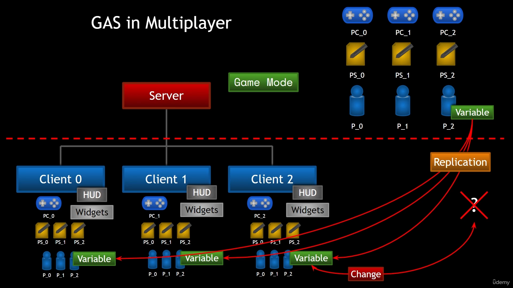
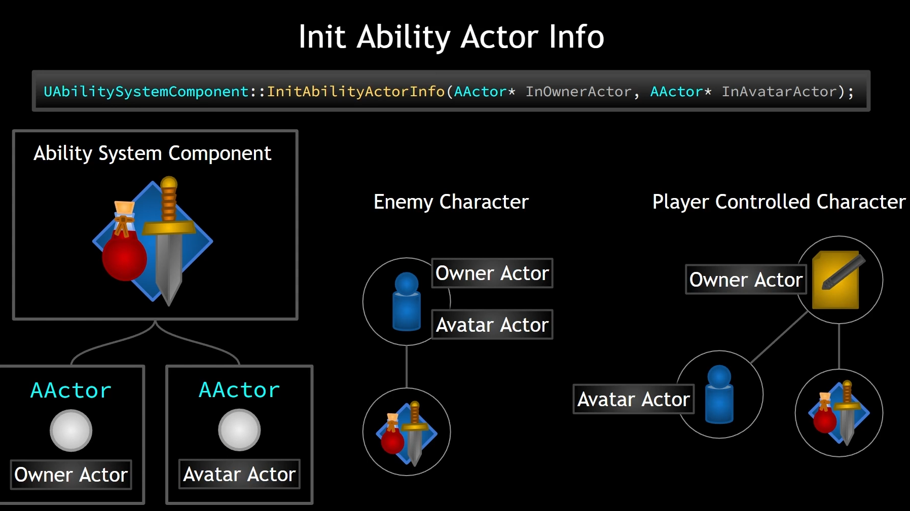
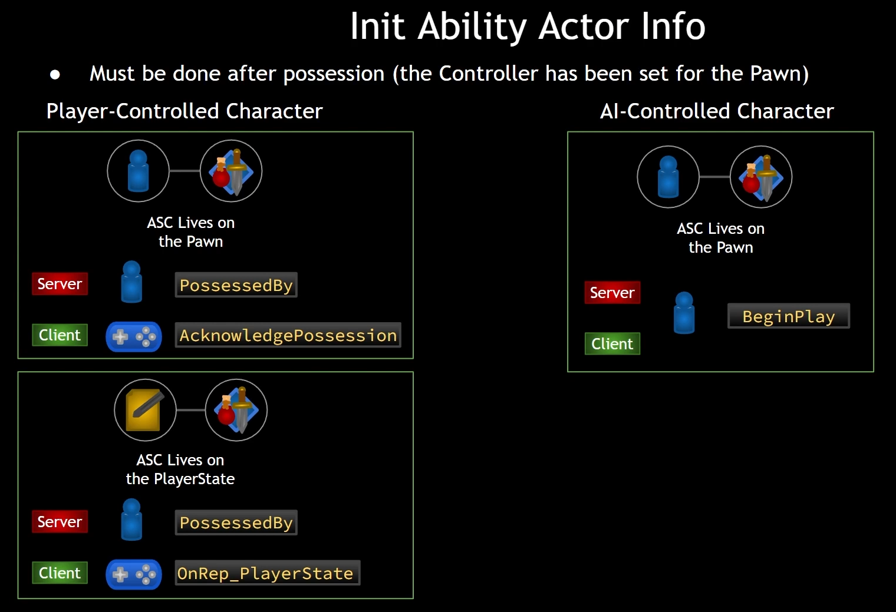

# 1. Introduction
The main part of GAS is implementing these 3 first. These are:
## 1.1 Ability System Component
A component that handles most about the GAS such as granting abilities,
activating abilities, handling notification, etc.

Something must be added to the Actor to be participated as GAS.

## 1.2 Attribute Set
Saves a lot of attributes that can be associated with any given object. Example of
attributes are like Health, Mana, Stamina, etc.

## 1.3 Gameplay Tags
Extremely useful for identifying just about anything. Their hierarchical nature
makes it more versatile.

# 2. GAS in Multiplayer
GAS has already handled most of the multiplayer case. But still, we need to understand how does the handling works.

## 2.1 Server Model

- Authority means the server is the "correct" version of a game
- There are 2 Server Models, they are Dedicated and Listen Server

## 2.2 Roles

- Game Mode only available on the server side, if a client attempted to access it will be null!
- Player Controllers are only available on EACH client only, if another client attempted to access this client it will be null!
- Player States and Pawns available on any clients.
- A replicated variable will be updated depends on the NetFrequency. It will update from the server to client.
- If a client attempted to change the replicated variable, it wont update the variable on the server or other clients.
To make it updated on the server and all clients, we can use RPC to change the replicated variable.

## 2.3 Replication Mode

- Mixed is needed for PlayerControlled, it is because the owning client need to know about the owning data for example to display the health, etc.
- Minimal is needed for AI-Controlled/Enemy because client doesn't need to know about the detail of AI's data.
- To set the replication mode we can just use the code above.

### 2.3.1 Mixed Replication Mode
In Mixed Replication Mode, for the system to function properly:

- The OwnerActor's owner must be the Controller. For example, when dealing with Pawns, this ownership is handled automatically via PossessedBy().
PlayerState's owner also defaults to the Controller automatically.
- If you're using an OwnerActor that isn't a PlayerState and want to use Mixed Replication Mode, then you need to manually set its owner to the Controller using SetOwner() on that OwnerActor.

# 3. Implementing Ability System Component and Attribute Set
Both can be implemented/attached on Pawn or Player State. Depends on the case, there are no best
place to be implemented.

## 3.1 Implement on Pawn
Usually used for Enemy Pawn. We can implement on Pawn if they are just simple.
Simple means if they die then the data can be erased without any further consideration.
For example, if the enemy is died then the attributes are useless so it is okay to be erased.

## 3.2 Implement on Player State
Usually used for complex object like player controlled pawn and Player State is best place for it instead of Player Controller.
If the data/attributes are important and we don't want to lose it along with the dying Pawn.
When the Pawn is destroyed/killed, the data is still available.

# 4. Implementation
Make sure to enable plugin called "GameplayAbilities" on the Editor. And the Module on the `.Build.cs`,
those modules are GameplayAbilities, GameplayTags, GameplayTasks.

## 4.1 Player State
When creating player state and on multiplayer game, we can set the `NetUpdateFrequency`.
Just as the documentation says, it's for how often (per second) this actor will be considered for replication, used to determine NetUpdateTime.
Basically, UE will try to update for that N time each second.

Don't forget to make the Blueprint of it and assign it to the Game Mode!

## 4.2 Ability System Component and Attribute Set
Just normally create it and no need Blueprint for it. And the boilerplate:
- Make pointers for both on the Base Character for references.
- Initialize both on the Character/Pawn for Enemy as it is simple case.
- Initialize both on the PlayerState for Player Controlled Pawn as it is complex case.
- Make sure to implement `IAbilitySystemInterface` for BaseCharacter and override the `GetAbilitySystemComponent` and create `GetAttributeSet`.

## 4.3. Init Ability Info
### 4.3.1 What is that?

- Ability System Component needs to know who is the owner and who is the world representation (avatar) to works well.
- This is a MUST step or else it won't work!.
- Owner can be different from the avatar, and it can be determined by where the Ability
System Component is initialized, for example:
  - For player controlled, the ASC is initialized at PlayerState then `PlayerState` is the owner.
  - For AI-controlled, the ASC usually initialized at the Pawn/Character then that `Pawn/Character` is the owner.

### 4.3.2 When to call?

- It MUST be called on the Avatar Actor, NOT the Owner Actor!
- For player controlled, we should call it RIGHT AFTER the possession.
- For AI-controlled, we can immediately call it on BeginPlay.
- We need to call it on both server and client!